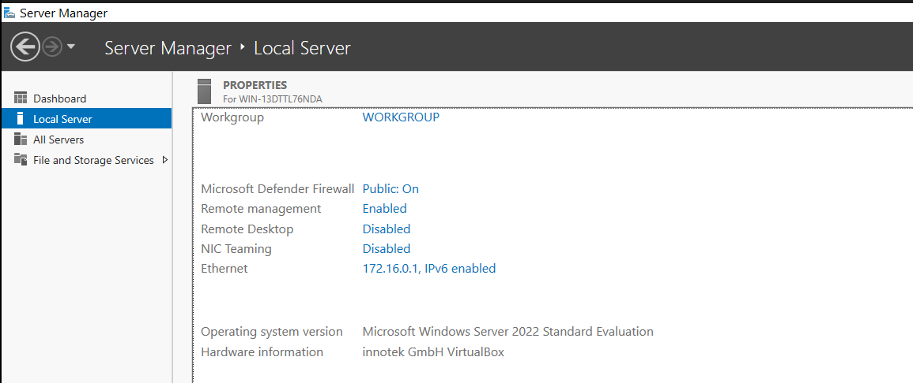

# 01 - Server Setup and Configuration

Building a Windows Server 2022 virtual machine in VirtualBox, installing Guest Additions, and prepping it for promotion to a Domain Controller.

---

## What I did

1. Downloaded the official Windows Server 2022 Evaluation ISO (180-day trial) from the Microsoft Evaluation Center.
2. Created a new VM in VirtualBox with these specs:
 - Name: DC-01
 - Type: Microsoft Windows
 - Version: Windows 2022 (64-bit)
 - RAM: 4096 MB
 - vCPU: 2 cores
 - Disk: 100 GB dynamically allocated
 - EFI enabled
3. Mounted the ISO and booted the VM.
4. During installation picked Windows Server 2022 Standard Evaluation (Desktop Experience) so I would get a full GUI rather than a Server Core command-line only build.
5. Chose Custom: Install Windows only (advanced) and let it expand files onto the 100 GB virtual disk.
6. Set a strong Administrator password.
7. Installed VirtualBox Guest Additions for shared clipboard, drag and drop, and proper screen resizing.
8. Renamed the computer to DC-01 and assigned a static IPv4 address of 172.16.0.1 with DNS set to 127.0.0.1 (the server pointing at itself, which is required once it becomes a DC).

The Server Manager Local Server tab confirmed all of this before promotion.

---

## Screenshot

Server Manager confirms the hostname, static IP assignment, and the readiness of the server before adding the Active Directory Domain Services role.

---

## Files in this section

- `README.md` - this file
- `difficulties.md` - what went wrong and how I fixed it
- `lessons.md` - what I took away
- `screenshots/` - proof of work
