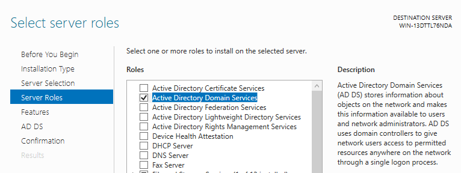
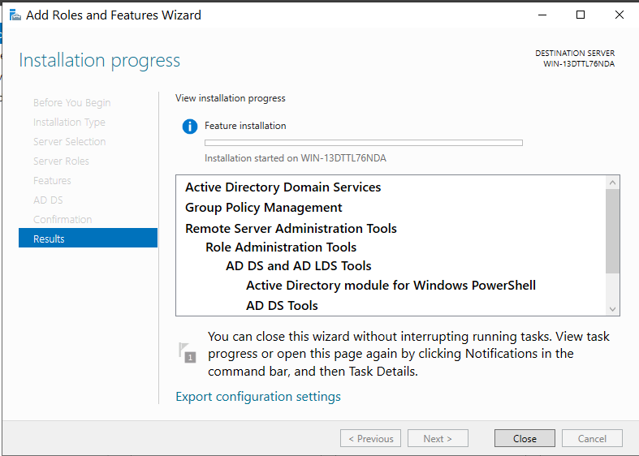
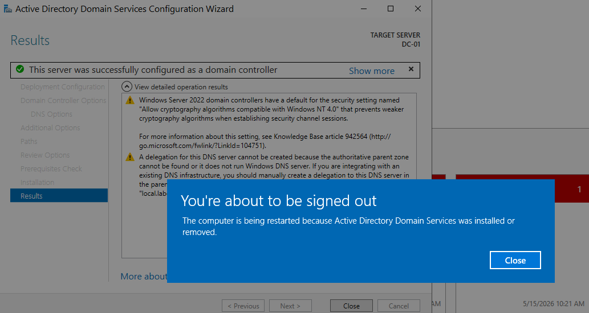
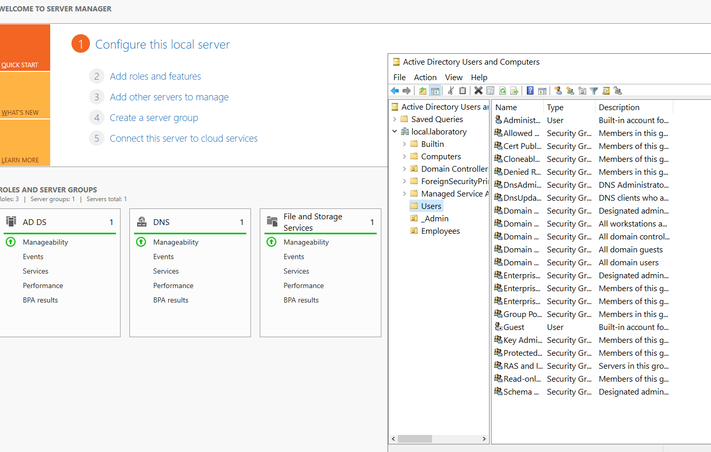

# 02 - Active Directory Installation

Adding the Active Directory Domain Services (AD DS) role to the server, then promoting it to a Domain Controller for a new forest called `local.laboratory`.

---

## What I did

1. Opened Server Manager and selected Add roles and features from the dashboard.
2. Chose Role-based or feature-based installation.
3. Selected the DC-01 server from the server pool.
4. Ticked Active Directory Domain Services. A popup appeared asking to add required features. Clicked Add Features.
5. Clicked through the wizard and let the binaries install.
6. After the install finished, a yellow warning flag appeared at the top of Server Manager. Clicked it and selected Promote this server to a domain controller.
7. Chose Add a new forest as the deployment configuration.
8. Set the Root domain name to `local.laboratory`.
9. Set a Directory Services Restore Mode (DSRM) password.
10. Skipped DNS delegation (this is the first DNS server in the forest, so there is nothing above it to delegate from).
11. Accepted the auto-generated NetBIOS domain name (LOCAL).
12. Left the default paths for the AD database, log files, and SYSVOL.
13. Reviewed the configuration summary.
14. Watched the prerequisite check pass with the green tick.
15. Clicked Install. The server automatically rebooted as part of the promotion.
16. After reboot, the login screen showed LOCAL\Administrator instead of Administrator. Promotion confirmed.

---

## Screenshots

### Selecting the AD DS role

Active Directory Domain Services selected in the Server Manager Add Roles and Features wizard.

### Installation in progress

The wizard installing the role binaries before the promotion step.

### Prerequisite check passed

The promotion prerequisites passed cleanly. The yellow warnings about cryptography and DNS delegation are expected for a brand new forest and are safe to ignore.

### Server Manager after promotion

After the promotion and reboot, Server Manager shows AD DS and DNS roles both running cleanly with green bars. This is the signal that the Domain Controller is healthy.

---

## Why a new forest

A forest is the top-level container in Active Directory. For a home lab, you create a new forest because there is no existing AD environment above you to join. The forest functional level on Server 2022 defaults to Windows Server 2016, which is the latest available functional level and supports every feature in the box.

## Why DNS comes along for the ride

Active Directory cannot run without DNS. When the server is promoted, the wizard automatically installs and configures the DNS Server role and creates a forward lookup zone for `local.laboratory`. This is why the server has to point its own DNS at 127.0.0.1 - it is the DNS server for the domain.

---

## Files in this section

- `README.md` - this file
- `difficulties.md` - issues hit during promotion
- `lessons.md` - key takeaways
- `screenshots/` - proof of work
