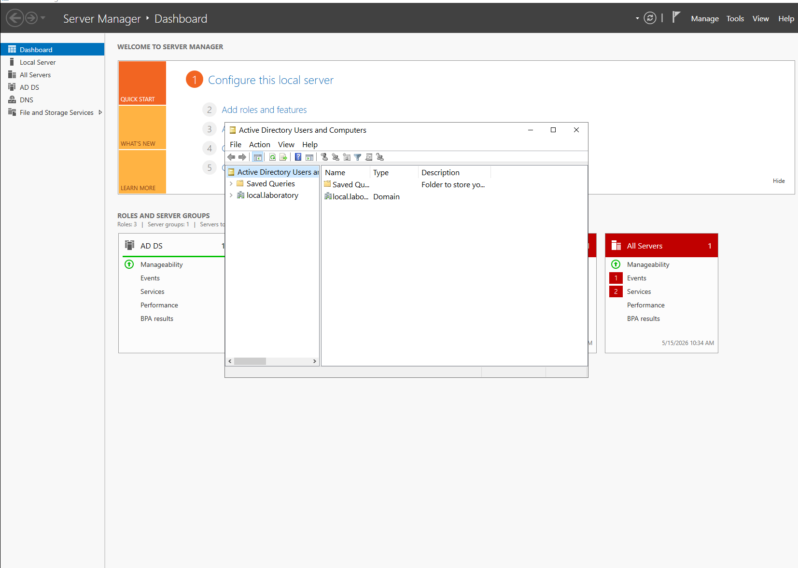
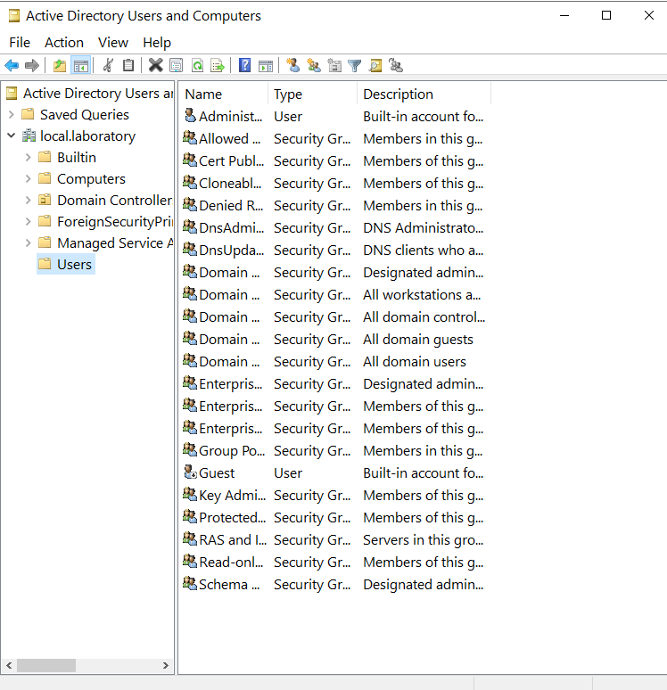
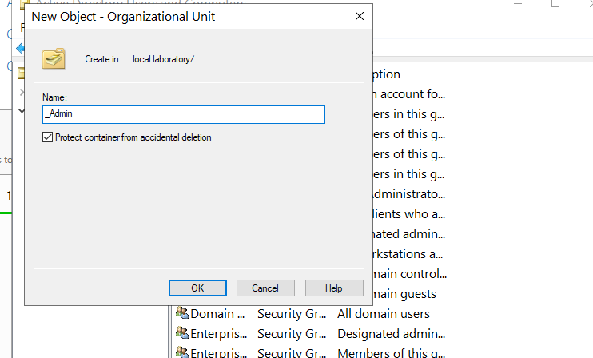
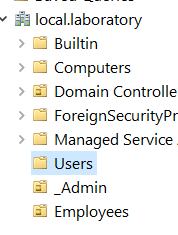
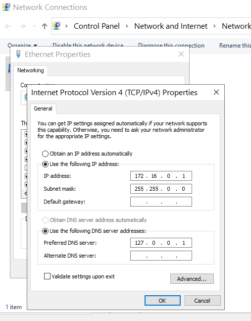

# 03 - User Management and Organisation

Designing an Organisational Unit (OU) structure for the fake company, creating my own admin account separated from the built-in Administrator, and verifying the DNS configuration stays clean after these changes.

---

## What I did

1. Opened Active Directory Users and Computers (ADUC) from Server Manager → Tools.
2. Looked at the default containers (Users, Computers, Builtin, Domain Controllers, Foreign Security Principals, Managed Service Accounts).
3. Created a custom OU named `_Admin` to hold privileged accounts. The underscore prefix sorts it to the top of the OU list which makes admin objects easy to find at a glance.
4. Created a second OU named `Employees` for standard user accounts.
5. Added a personal admin account inside `_Admin` so that day-to-day admin work does not use the built-in Administrator account.
6. Added a sample employee account inside `Employees` to confirm the OU structure works for regular users.
7. After all this object creation, opened Local Server in Server Manager to confirm the static IP and DNS server settings had not been changed by AD's network configuration.

---

## Screenshots

### First open of Active Directory Users and Computers

The default view of ADUC after the domain is built. The default containers are visible on the left.

### Default users and computers

The default Users container holds the built-in Administrator and Guest accounts along with the default security groups.

### Creating the _Admin OU

Naming the admin OU with a leading underscore is a common admin trick. ADUC sorts OUs alphabetically with symbols ranking above letters, so `_Admin` appears at the top of the list every time.

### Admin and employee OUs created

The custom OU structure in place. Privileged accounts go in `_Admin`, regular staff go in `Employees`. This separation makes Group Policy targeting much cleaner later.

### Verifying DNS still points correctly

Local Server confirms the static IP (172.16.0.1) and DNS (127.0.0.1) are still correctly set after all the OU and user changes. Good practice to check this after any major directory work.

---

## Why a separate admin account

Using the built-in Administrator account for everyday admin work is a known bad habit. The recommended pattern is:

1. Built-in Administrator stays untouched as a break-glass account
2. Each admin gets their own named admin account (e.g. `iris-admin`)
3. Each admin also has a separate standard user account for normal browsing, email, etc.

This separation means audit logs show who did what. If something goes wrong, you know which admin to ask.

---

## Why the underscore trick

`_Admin` versus `Admin` looks like a tiny detail, but it matters in larger environments. In a domain with 30 or 40 OUs, putting your admin OU at the top of the list saves seconds every time you open ADUC. Multiply that by years of admin work and the saved time adds up.

---

## Files in this section

- `README.md` - this file
- `difficulties.md` - issues during user management
- `lessons.md` - what I learned
- `screenshots/` - proof of work
