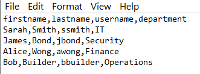
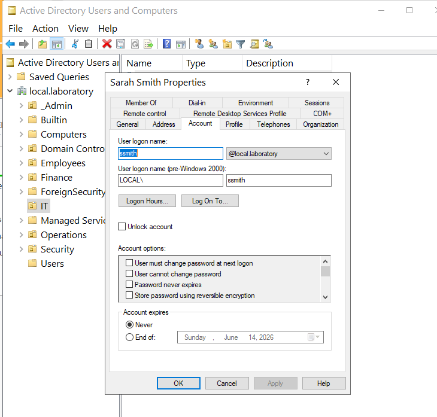

# 04 - PowerShell Bulk User Automation

Writing a PowerShell script that reads a CSV file of fake HR data and creates the matching users in Active Directory, placing each user inside an OU named after their department. OUs are created on the fly if they do not already exist.

This is the section that took the most time to get working because of a race condition and a Group Policy issue (covered in section 05).

---

## Why automate

In a real support role, manually creating users in ADUC for a single new starter is fine. Doing it for 50 new starters during an onboarding wave is not. Bulk import scripts are how real admins handle:

- New starter waves at the beginning of a term or quarter
- Department restructures
- Lab and test environment provisioning
- Recovery scenarios where the AD database has to be rebuilt

A working bulk import script is one of the strongest skills to show on a portfolio.

---

## The data

The script reads from a simple CSV at `C:\users.csv`:

```
firstname,lastname,username,department
Sarah,Smith,ssmith,IT
James,Bond,jbond,Security
Alice,Wong,awong,Finance
Bob,Builder,bbuilder,Operations
```

This mimics the kind of file an HR team would hand off to IT before a new starter wave.



---

## What the script does

1. Loads the CSV with `Import-Csv`.
2. Finds the unique list of departments and creates an OU for each one that does not already exist.
3. Pauses for 2 seconds to give AD time to register the new OUs.
4. Loops through every row in the CSV and runs `New-ADUser` to create the account, placing it in the matching department OU.
5. Wraps the user creation in a try/catch block so one bad row does not kill the whole import.

The full script is in `scripts/bulk-user-creator.ps1`. The CSV template is in `scripts/users.csv`.

---

## Running it

```powershell
# On the Domain Controller, as Administrator
cd C:\path\to\scripts
.\bulk-user-creator.ps1
```

You will see output like:

```
OU Created: IT
OU Created: Security
OU Created: Finance
OU Created: Operations
User Created: ssmith -> IT
User Created: jbond -> Security
User Created: awong -> Finance
User Created: bbuilder -> Operations
```

---

## Proof of work

After the script completed successfully, I opened ADUC and double-clicked Sarah Smith in the IT OU. Her Account tab showed the correct logon name (`ssmith`) and UPN suffix (`@local.laboratory`).



This confirms the script wrote the right values for `SamAccountName`, `UserPrincipalName`, and `Path`.

---

## Files in this section

- `README.md` - this file
- `difficulties.md` - the two major errors I hit and how I fixed them
- `lessons.md` - what I took away
- `scripts/bulk-user-creator.ps1` - the working script
- `scripts/users.csv` - sample CSV input
- `screenshots/` - proof of work
