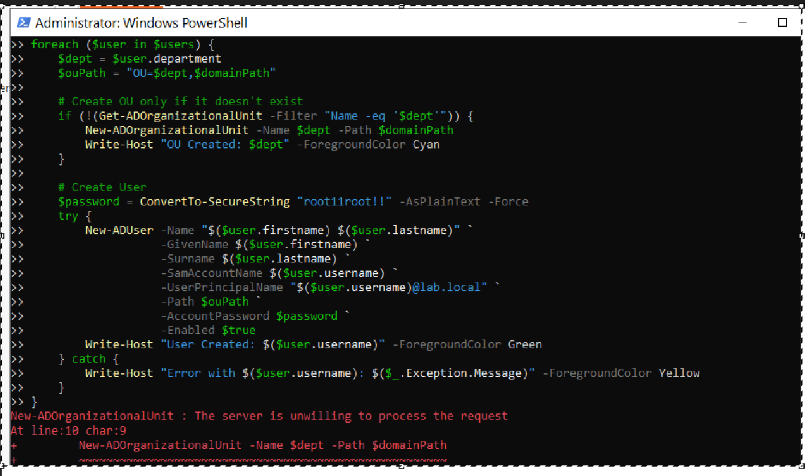
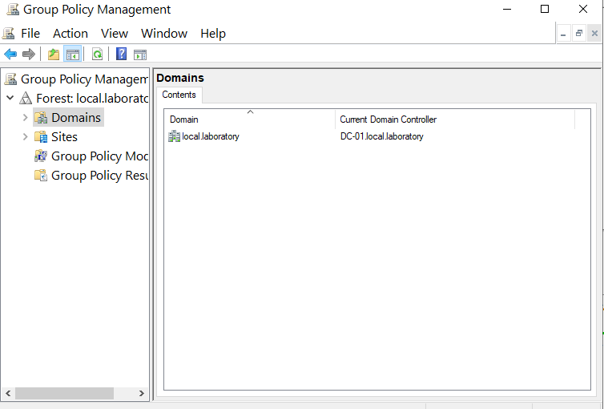
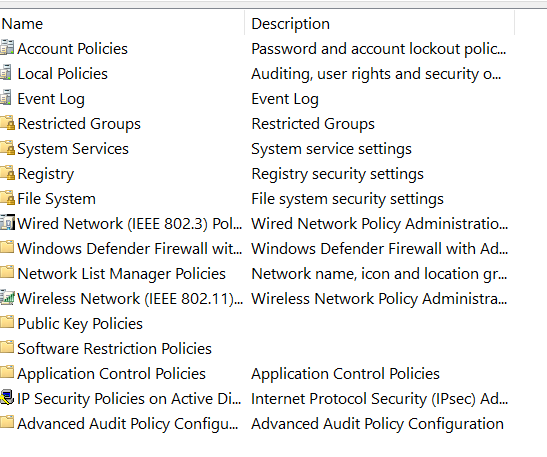
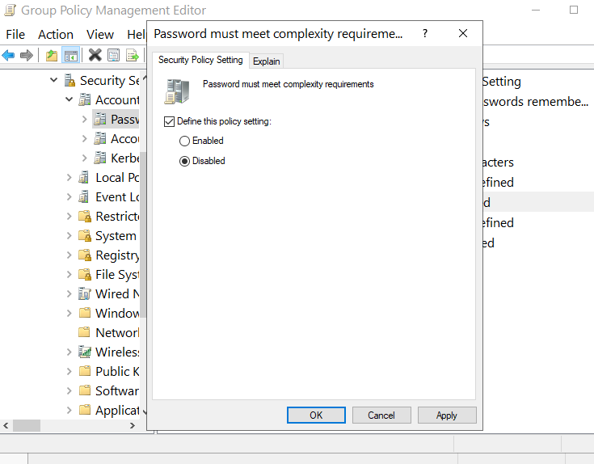
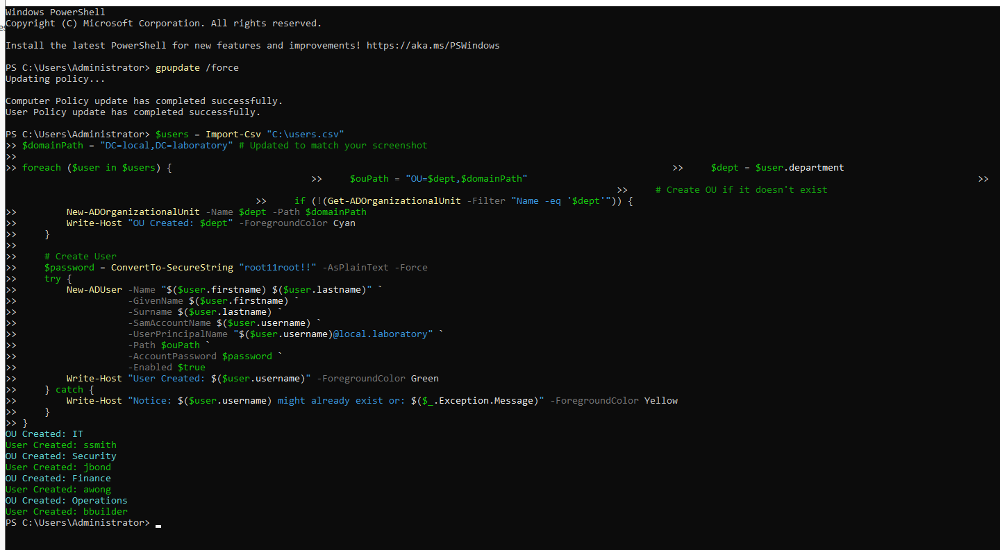

# 05 - Group Policy Password Configuration

Using Group Policy Management Console (GPMC) to disable the default password complexity requirement on the Default Domain Policy, so that the bulk user creation script in section 04 could finish successfully. This section demonstrates the link between a real admin task (script failing) and the underlying policy that caused it.

This is a lab-only change. In production you would not disable complexity. You would either choose passwords that meet the policy or set a Fine-Grained Password Policy (FGPP) for specific groups.

---

## The problem (recap from section 04)

The bulk user creation script kept throwing "The server is unwilling to process the request" on the `New-ADUser` line. The password I had picked, even after iterating through several values, was being rejected by the Default Domain Policy.

The "unwilling to process" message is AD's deliberately vague way of saying a policy blocked the action. The actual cause is the password complexity requirement.

---

## What I did

1. Opened Server Manager → Tools → Group Policy Management.

 

2. Expanded the forest, then the domain (`local.laboratory`), then the Group Policy Objects container.

3. Right-clicked Default Domain Policy and selected Edit. This opened the Group Policy Management Editor.

4. Navigated to: Computer Configuration → Policies → Windows Settings → Security Settings → Account Policies → Password Policy.

 

5. Double-clicked "Password must meet complexity requirements" and set it to Disabled.

 

6. Closed the editor.

7. Opened PowerShell and ran `gpupdate /force` to apply the policy change without waiting for the default 90-minute refresh interval.

8. Re-ran the bulk user creation script. Success.

 

---

## Why "Default Domain Policy"

There are two default GPOs created when a forest is built:

- Default Domain Policy. Applies to every object in the domain. Holds account policies (password, lockout, Kerberos). This is the one to edit for domain-wide password rules.
- Default Domain Controllers Policy. Applies only to the Domain Controllers OU. Holds DC-specific security settings.

Account policies (passwords, lockout) have to be set at the domain level. You cannot use a regular OU-linked GPO to change them. The only way around this is Fine-Grained Password Policies (FGPP), which are configured separately under the Password Settings Container.

---

## Why disabling complexity is bad in production

In a real environment, disabling password complexity would be a major security finding on any audit. Better approaches:

1. Pick passwords that meet the policy. The script's default password (`root11root!!`) does meet complexity in most defaults, but the policy here was stricter than I expected.
2. Use Fine-Grained Password Policies to relax requirements for service accounts or specific groups, without weakening the whole domain.
3. Move towards passwordless authentication (Windows Hello for Business, FIDO2 keys) which sidesteps the password complexity debate entirely.

For a controlled lab environment with no internet exposure, disabling complexity is acceptable. I would not do this on a real domain.

---

## gpupdate /force explained

By default, GPO changes apply to clients on a refresh cycle of every 90 minutes (with a 30-minute random offset). For Domain Controllers, the cycle is every 5 minutes. `gpupdate /force` skips the wait and applies changes immediately.

Use cases for `gpupdate /force`:

- Testing a GPO change you made
- Troubleshooting "policy did not apply" tickets
- Demonstrating to a user that a change worked

---

## Files in this section

- `README.md` - this file
- `difficulties.md` - issues hit during the GPO edit
- `lessons.md` - what I learned
- `screenshots/` - proof of work
