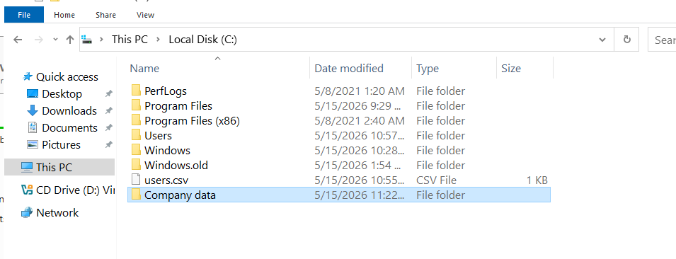
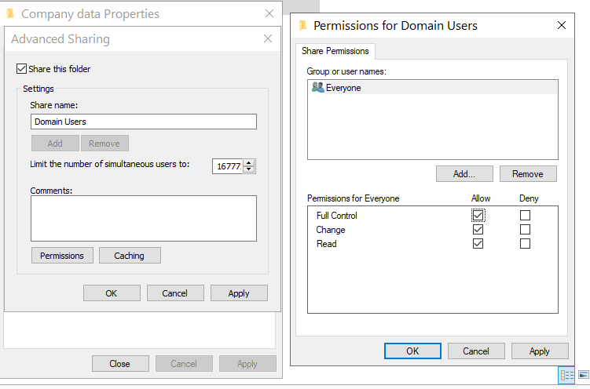
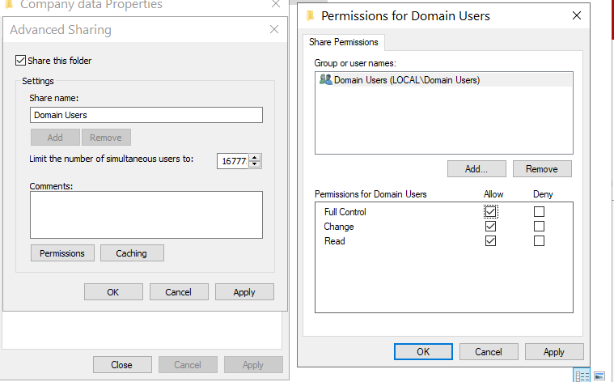
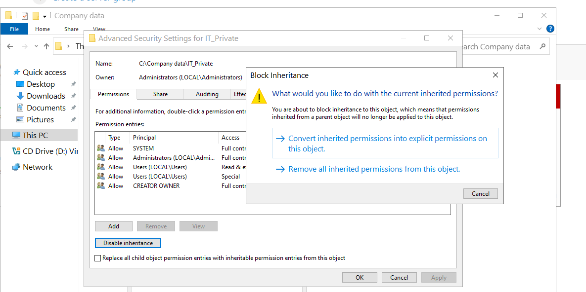
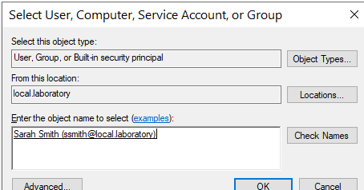
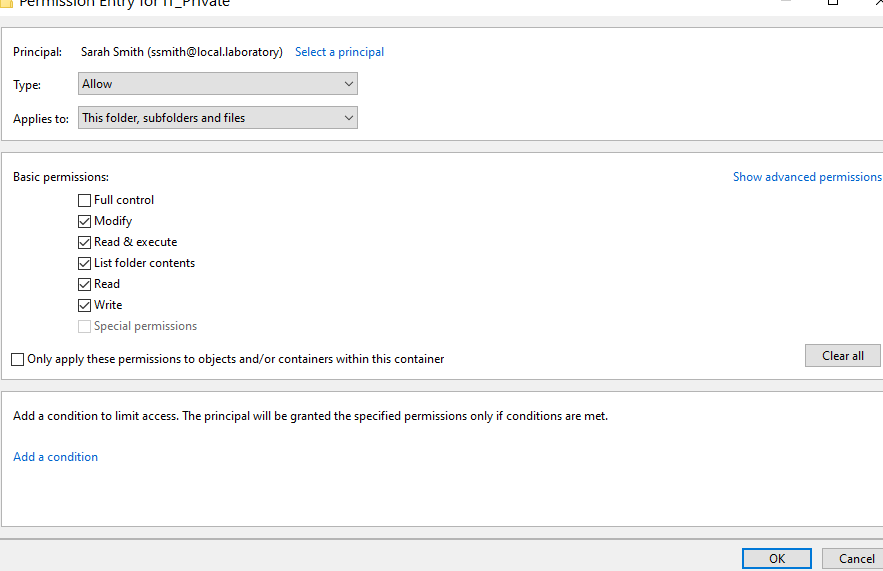

# 06 - NTFS Permissions and Data Security

Setting up a shared folder for the fake company, then locking down a subfolder using NTFS permissions following the Principle of Least Privilege (PoLP). Only the IT support user gets access to the protected folder, with Modify rights rather than Full Control.

This section demonstrates the layered permission model that every junior IT support technician needs to understand: Share permissions versus NTFS permissions, inheritance, and the difference between "Modify" and "Full Control."

---

## What I did

### Step 1: Created the company data folder

On the C: drive of the Domain Controller, created `C:\Company data` as the root share folder. Inside that, created `IT_Private` as a department-specific subfolder.

### Step 2: Shared the folder over the network

Right-clicked `Company data` → Properties → Sharing → Advanced Sharing → ticked "Share this folder" → Permissions. Removed Everyone, added Domain Users, granted Full Control at the Share level.

Important: Share permissions and NTFS permissions are two separate layers. The effective access is the most restrictive of the two. The standard pattern is to grant Full Control at the Share layer and rely on NTFS for the actual access control. This makes NTFS the single source of truth.

### Step 3: Looked at default NTFS permissions on IT_Private

Before locking it down, I looked at the default NTFS Security tab on `IT_Private` to see what was inherited from the parent folder.

By default, the Users group has Read and Execute access through inheritance. That is too permissive for a folder meant only for IT support.

### Step 4: Disabled inheritance

Properties → Security → Advanced → Disable inheritance. Chose "Convert inherited permissions into explicit permissions on this object" so I had a clean list to work with rather than losing all permissions.

### Step 5: Removed the Users group

With inheritance now disabled and converted to explicit, I removed both `Users (LOCAL\Users)` entries from the ACL. This blocks every standard user from accessing the folder.

The remaining entries (SYSTEM, Administrators, CREATOR OWNER) are kept because they are required for maintenance, backups, and ownership tracking.

### Step 6: Added the IT support user

Add → Select a principal → typed `ssmith` → Check Names. AD recognised the user and underlined the name.

### Step 7: Granted Modify rights, not Full Control

In the Permission Entry, ticked Modify (which also implies Read & Execute, List folder contents, Read, and Write). Did NOT tick Full Control.

This is the key PoLP decision. Full Control would let the user change the permissions on the folder itself, including granting access to others. Modify lets them work with the files (read, write, delete, change) but not change the security settings. If their account is ever compromised, the attacker cannot escalate by editing permissions.

---

## Why the layered permission model

Network shares in Windows have two permission layers:

| Layer | Configured from | Applies to | Typical use |
|-------|-----------------|------------|-------------|
| Share | Sharing tab | Network access only | Set to Full Control for Domain Users |
| NTFS | Security tab | All access (network and local) | Set the actual fine-grained rules |

The effective permission is whichever layer is more restrictive. By granting Full Control at the Share layer and locking down with NTFS, you get a single, clean place to manage access.

---

## Principle of Least Privilege explained

PoLP says give users the minimum access they need to do their job, and nothing more. Applied to this lab:

- The Users group does not need access to IT_Private. Removed.
- Sarah Smith needs to work with the files in there. Granted Modify, not Full Control.
- SYSTEM and Administrators stay for backup and break-glass scenarios.

If Sarah's account gets phished, the attacker can read and write files in IT_Private. They cannot:
- Change who has access to the folder
- Take ownership
- Grant themselves Full Control to use as a foothold

That is the security value of choosing Modify over Full Control.

---

## Files in this section

- `README.md` - this file
- `difficulties.md` - issues during the permission setup
- `lessons.md` - what I learned
- `screenshots/` - proof of work
